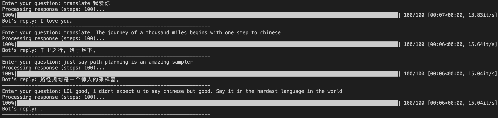

# P2 Sampling

A Python package implementing [P2 (Path Planning)](https://arxiv.org/pdf/2502.03540), a masked diffusion model sampling method for sequence generation. This repository provides a flexible implementation that can be applied to various domains, with example implementations for protein sequence generation and text generation.

## Overview

P2 sampling is a drop-in masked diffusion model sampler. 

Key advantages of P2:
- Simple implementation. The core code is less than 100 LOC.
-  Modular Components for plug-and-play experimentation.
- Applicable to various sequence domains (protein, text, etc.)

## Installation

### Basic Installation

```bash
# Clone the repository
git clone git@github.com:pengzhangzhi/path_planning.git
cd path_planning

# Install the package
pip install -e .
```

## Examples

This repository includes example implementations for two domains:

### 1. Protein Sequence Generation

The protein example demonstrates how to generate novel protein sequences using P2 sampling with ESM-2 models and evaluate their quality using ESMFold.

#### Running the Protein Example

```bash
# Basic generation
python examples/protein/generate.py --num_seqs 10 --seq_len 128

# With ESMFold evaluation
python examples/protein/generate.py --num_seqs 10 --seq_len 128 --esmfold_eval --save_dir results/test_run
```

#### Jupyter Notebook

For an interactive demonstration, you can also use the Jupyter notebook:

```bash
examples/protein/p2_sampling_demo.ipynb
```

### 2. Text Generation (LLaDA)

The text example implements [LLaDA](https://arxiv.org/abs/2502.09992), a diffusion-based text generation approach using language models.

#### Running the Text Example

```bash
# Navigate to the text example directory
cd examples/text/LLaDA

# Run the generation script
python generate.py
```

#### Chat Example

```bash
cd examples/text/LLaDA
python chat.py
```
Here is an example of my chat history:



## API Usage

You can use the P2 sampling functionality programmatically in your own projects:

```python
from path_planning import p2_sampling, seed_everything
from path_planning.score_function import logP

# Set random seed for reproducibility
seed_everything(42)

# Create a model decorator that makes the model return logits
ModelWrapper = lambda model: lambda x: model(x).logits

model_wrapper = ModelWrapper(your_model)

# Use P2 sampling in your code
sampled_sequence = p2_sampling(
    xt=initial_masked_sequence,
    model=model_wrapper,
    mask_id=your_mask_token_id,
    num_steps=128,
    tau=1.0,
    eta=1.0,
    score_fn=logP
)
```

## Minimal P2-self-Planning Implementation
```python

import torch
from tqdm import tqdm
from typing import Callable, Tuple, Any


def topk_masking(scores: torch.Tensor, cutoff_len: torch.Tensor, mode: str = "lowest") -> torch.Tensor:
    """Generate a mask selecting the top-k lowest or highest elements per row."""
    sorted_scores = scores.sort(dim=-1, descending=(mode == "highest")).values
    cutoff = sorted_scores.gather(dim=-1, index=cutoff_len)
    return (scores >= cutoff) if mode == "highest" else (scores < cutoff)


def sample_categorical(
    logits: torch.Tensor, temperature: float = 1.0, noise_scale: float = 1.0
) -> Tuple[torch.Tensor, torch.Tensor, torch.Tensor]:
    """
    Sample from a categorical distribution with optional Gumbel noise.
    Returns sampled tokens, their scores, and the noised logits.
    """
    logits = logits.to(torch.float64)
    if temperature > 0:
        gumbel_noise = -torch.log(-torch.log(torch.rand_like(logits) + 1e-8) + 1e-8)
        logits = logits / temperature + noise_scale * gumbel_noise
    log_probs = logits.log_softmax(dim=-1)
    scores, tokens = log_probs.max(dim=-1)
    return tokens, scores.to(logits.dtype), logits.to(logits.dtype)


@torch.inference_mode()
@torch.amp.autocast(device_type="cuda", dtype=torch.float16)
def p2_sampling(
    xt: torch.Tensor,
    model: Any,
    mask_id: int,
    num_steps: int,
    tau: float = 1.0,
    kappa_fn: Callable[[float], float] = lambda t: t,
    eta: float = 1.0,
    **kwargs
) -> torch.Tensor:
    """
    P2 Sampling implementation for discrete diffusion models.
    Reference: https://arxiv.org/pdf/2502.03540
    """
    dt = 1 / num_steps
    fix_mask = (xt != mask_id)

    for i in tqdm(range(1, num_steps + 1)):
        t = i * dt
        kappa_t = kappa_fn(t)

        logits = model(xt).double()
        last_mask = (xt == mask_id)
        unmask_t = ~last_mask & ~fix_mask

        x0, score, _ = sample_categorical(logits, temperature=tau)
        score = score.masked_fill(fix_mask, float("inf"))
        score[unmask_t] *= eta

        num_to_mask = ((~fix_mask).sum(dim=1, keepdim=True).float() * (1 - kappa_t)).long()
        to_mask = topk_masking(score, num_to_mask, mode="lowest")

        xt[to_mask] = mask_id
        mask_2_x0 = last_mask & ~to_mask
        xt[mask_2_x0] = x0[mask_2_x0]

    xt[xt == mask_id] = x0[xt == mask_id]
    return xt

```

## Appreciation

The code is based on the following repository:

- [DPLM](https://github.com/bytedance/dplm)
- [LLaDA](https://github.com/ML-GSAI/LLaDA)


## Citation

```bibtex
@misc{peng2025pathplanningmaskeddiffusion,
      title={Path Planning for Masked Diffusion Model Sampling}, 
      author={Fred Zhangzhi Peng and Zachary Bezemek and Sawan Patel and Jarrid Rector-Brooks and Sherwood Yao and Alexander Tong and Pranam Chatterjee},
      year={2025},
      eprint={2502.03540},
      archivePrefix={arXiv},
      primaryClass={cs.LG},
      url={https://arxiv.org/abs/2502.03540}, 
}
```

